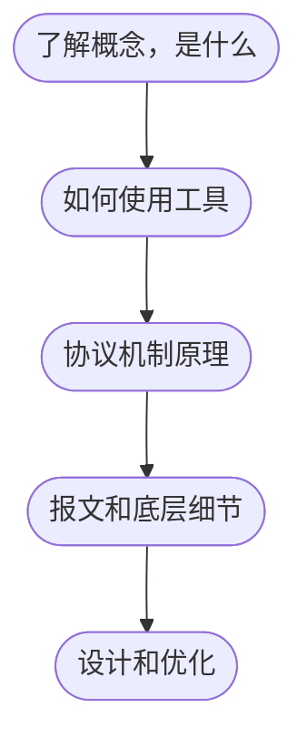

# 3. 网络工程与网络工程师

通信网络需要网络工程师去规划、设计、实施、调试和运维。

*@def* **网络工程**，就是围绕着网络进行的一系列的活动，包括：网络规划、设计、实施、调试、排错等。

网络工程设计的知识领域很宽广，其中路由和交换是计算机网络的基本。对于一名网络工程师来说，需要更关注数据的端到端传递的过程。

网络工程师的技术成长路线：
1. 这是什么：什么是路由，什么是交换？
2. 这怎么用：OSPF 怎么配置，怎么验证和查看？
3. 协议机制：OSPF（Open Shortest Path First）连接关系如何建立？STP（Spanning Tree Protocol）的详细工作过程如何？
4. 报文及底层：协议的底层工作机制、报文层面的细节
5. 规施排优：方案设计、网络规划、实施、排错、优化

