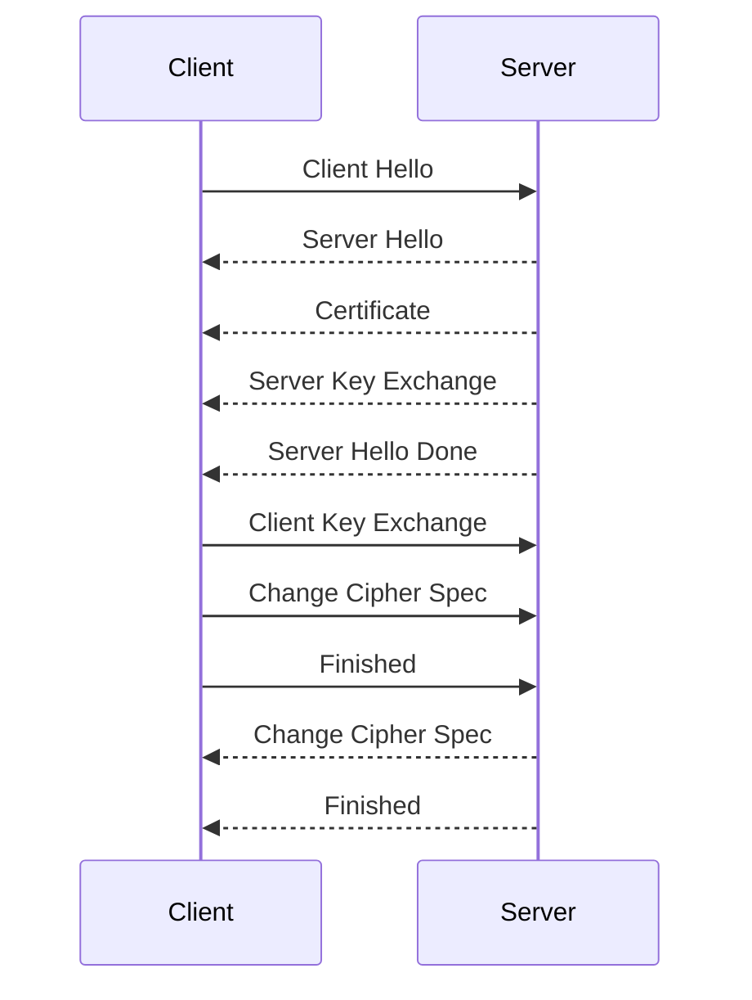

# HTTPS RSA 握手

[[TOC]]

HTTP 由于是明文传输，所谓的明文，就是说客户端与服务端通信的信息都是肉眼可见的，随意使用一个抓包工具都可以截获通信的内容。

所以安全上存在以下三个风险：

- **窃听风险**，比如通信链路上可以获取通信内容，用户号容易没。
- **篡改风险**，比如强制植入垃圾广告，视觉污染，用户眼容易瞎。
- **冒充风险**，比如冒充淘宝网站，用户钱容易没。

HTTPS 在 HTTP 与 TCP 层之间加入了 TLS 协议，来解决上述的风险。

TLS 协议是如何解决 HTTP 的风险的呢？

- **信息加密**： HTTP 交互信息是被加密的，第三方就无法被窃取；
- **校验机制**：校验信息传输过程中是否有被第三方篡改过，如果被篡改过，则会有警告提示；
- **身份证书**：证明淘宝是真的淘宝网；

可见，有了 TLS 协议，能保证 HTTP 通信是安全的了，那么在进行 HTTP 通信前，需要先进行 TLS 握手。TLS 的握手过程，如下图：

